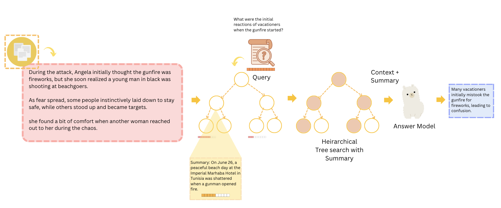

# DynamiTree: A Dynamic Update Algorithm for Scalable Long-Term Memory Retrieval
**DynamiTree** is an efficient memory-augmented QA system that leverages a B+ Tree structure for storing and summarizing facts. It supports dynamic insertions, hierarchical summarization, and relevance-based retrieval, making it suitable for tasks like long document or meeting QA, policy tracking, and more.

---



---

## 📁 Project Structure

```
├── demo.py                 # Main orchestration script
├── requirements.txt
DynamiTree/
├── utils.py                # Core B+ Tree logic, insert/retrieve/generate
├── answer_prompt.py        # Prompt for answering questions
├── summary_prompt.py       # Prompt for summarization

```

---

## Installation

### 1. Clone the Repository

```bash
git clone https://github.com/charvibannur/DynamiTree.git
cd DynamiTree/Github
```

### 2. Set Up Your Environment

Using Conda:

```bash
conda create -n dynami-tree python=3.9
conda activate dynami-tree

pip install -r requirements.txt
```

---

### 3. Add Your API Keys

Add your OpenAI or Together AI API keys directly to `utils.py` by setting:

```python
os.environ["OPENAI_API_KEY"] = "your_openai_api_key"
os.environ["TOGETHER_API_KEY"] = "your_together_api_key"
os.environ["TOGETHER_BASE_URL"] = "https://api.together.xyz/v1"
```

---


### Manual Insert + Query

You can insert custom facts and run ad hoc queries like this:

```python
from demo import initialize_tree_and_insert, query_tree_and_answer

initialize_tree_and_insert("Fact 1...")
initialize_tree_and_insert("Fact 2...")
query_tree_and_answer("Query")
```

---


## License

MIT License © 2025. See the LICENSE file in the repository for full details.

